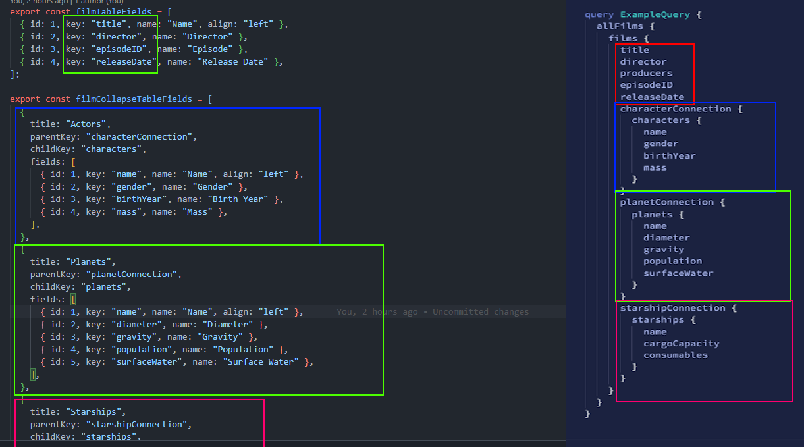

# Star Wars API - GRAPHQL & MATERIAL UI

This is a React Typescript Project about fetching Star Wars Graphql API

- [Demo](https://starwars-apollo-graphql.netlify.app)

## Usage:

1. Open your terminal and run:

   ```bash
   yarn or npm install
   ```

2. Run the project with:

   ```bash
   yarn start or npm run start
   ```

## Development:

This Project has a dynamic system If you want to add a new page follow these steps:

1. Open src/utils/table-fields/dummy file. Just read Informations

Create your dynamic query request just like in the photo.
<picture>

</picture>

2. If you want to add tablefields. You have to dynamically set it in the helper file. Open src/utils/helpers
   ```bash
   allfilms: filmCollapseTableFields,
   // allfilms = pathname, filmCollapseTableFields your new table field variable
   ```

Feel free to contribute and make this project even better.
